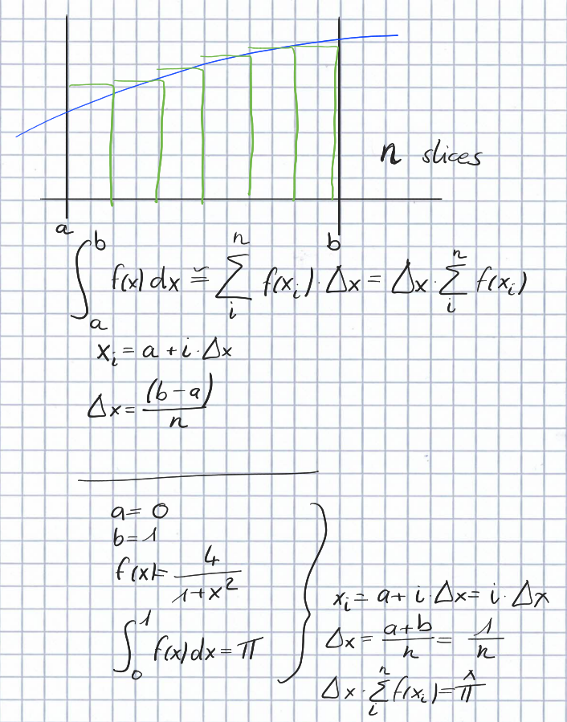
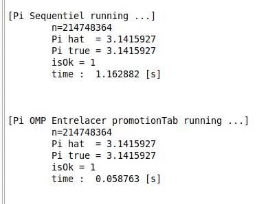

# Cours 1

**GPGPU** : (General-Purpose computing on Graphics Processing Units) est une technologie qui utilise les processeurs graphiques (GPU) pour effectuer des calculs complexes et à usage général, au-delà des tâches traditionnelles de rendu graphique.
**Cuda** : language de programmation dévoloppée par NVIDIA

Avant CUDA, on va utiliser OMP (C++) -> pour apprendre le principal paradigme de programmation GPU

## Enoncé du problème

Déplacer un grand tas de grains de riz d'un endroit à un autre
- une fourmi peut porter un grain de riz
- donner à toutes les fourmis le même algo
- les fourmis ne peuvent pas communiquer entre elles, ni les voir -> pas de concurrence
- chaque fourmi a un numéro
- grain de riz numéroté
- fourmis ne connaissent pas les math, à part additionner 2 nombres

### Notre algo

- Vous êtes la fourmis Nx parmi N fourmis, votre rôle est de monter un grain de riz défini depuis la rue en salle 306.
- Voici la carte pour le déplacement
- Le grain de riz à transporter est défini par votre numéro. Une fois un cycle terminé, additionnez N au numéro du dernier grain de riz pris en charge pour définir le nouveau à transporter.
- Vous devez recommencer tant que le numéro de grain de riz à prendre en charge existe

### Equivalence fourmi <-> thread

Dans la suite du cours, le numéro de la fourmi est en réalité le TID (thread ID).

## OpenMP

Spécification pour le parallélisme en mémoire partagée. Tous les compilateurs de nos jours la respectent.

Comment écrire du code parallèle avec OpenMP en C/C++ ?

```c
#pragma omp parallel
{
    // boîte blanche
}
```

GCC va s'occuper d'exécuter en paralléle tout le code qui se trouve dans la boîte blanche. Il va utiliser toutes les ressoucres à disposition.

### Exercices

Paralléliser ce code C séquentiel qui déplace N grains de riz avec une seule fourmi :

```c
n = N_GRAINS_RIZ;
for (int i = 0; i < n; i++){
    work(i);
}
```

En utilisant OpenMP, on a :

```c
n = N_GRAINS_RIZ
#pragma omp parallel
{
    const int TID = Omps::getTID();
    const int NB_THREAD = std::thread::get_nb_thread();

    int s = TID;
    while (s < n){
        work(s);
        s += NB_THREAD;
    }
}
```

La question a se poser quand on veut écrire du code dans la boîte blanche est : 
**"Je suis une fourmi, qu'est-ce que je dois faire ?"**

## TP

Voici le but du TP : calculer une valeur approchée de pi en utilisant la méthode des rectangles pour approximer l'intégrale de f(x) = 4/(1+x^2) entre 0 et 1.



```c
double piSequentiel(int n)
    {
    const double DX = 1 / (double)n;
    double somme = 0;
    for (int i = 0; i < n; i++)
	{
	double xi = i * DX;
	somme += fpi(xi);
	}
    return somme * DX;
    }
```

Le code parallèle avec OpenMP est le suivant :

```c
double piOMPEntrelacerPromotionTab(int n)
    {
    const double DX = 1/(double)n;
    int NB_THREAD = Omps::setAndGetNaturalGranularity(); // Autant de thread que de coeurs logiques
    double sum[NB_THREAD];

    // reduction intra thread
#pragma omp parallel
	{
	const int TID = Omps::getTid();
	int s = TID;
	double xi;
	double sum_thread = 0; // mieux de faire une variable locale comme ca il est dans les registres, donc tr�s rapide
	while (s < n)
	    {
	    xi = s * DX;
	    sum_thread += fpi(xi);
	    s += NB_THREAD;
	    }
	sum[TID] = sum_thread;
	}
    double total = 0;
    for (int i = 0; i < NB_THREAD; i++)
	{
	total += sum[i];
	}
    return DX*total;
    }
```

Voici les résultats obtenus :



On remarque que le code parallèle est beaucoup plus rapide que le code séquentiel.